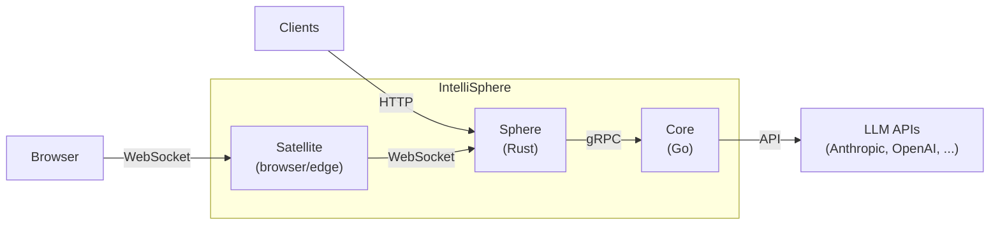
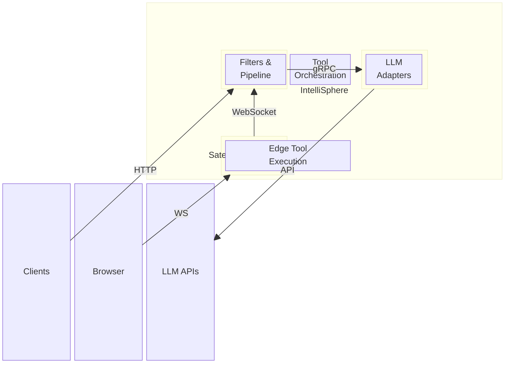

# IntelliSphere

A secure, configurable proxy and orchestration layer for Agentic AI. IntelliSphere sits between your applications and LLM providers, providing security filters, tool orchestration, policy enforcement, and audit trails — so you can use AI agents safely in production.

## Architecture





### Components

| Component | Language | Purpose |
|-----------|----------|---------|
| **Sphere** | Rust | Security boundary: auth, filters, tool orchestration, policy engine, audit |
| **Core** | Go | Thin LLM proxy: translates gRPC to provider-specific APIs |
| **Satellite** | TypeScript | Browser-side edge tool execution with trust budgets |
| **SDK** | TypeScript | Tool authoring SDK for creating custom tools |
| **CLI** | Go | Developer tooling for creating, validating, and testing tools |

## Features

- **Inbound Filters**: Input sanitization, prompt injection detection, PII redaction, topic guardrails, token budgets, conversation boundaries
- **Outbound Filters**: PII leak detection, injection echo detection, response classification, result size enforcement, hallucination flagging
- **Tool Orchestration**: Multi-turn tool loops, JSON Schema validation, scoped HTTP clients, timeout enforcement, panic containment
- **Authentication**: JWT (HS256/RS256) and API key strategies, configurable per deployment
- **Rate Limiting**: Token bucket — global, per-identity, and per-tool
- **Policy Engine**: Declarative YAML policies for session, identity, tool, and tenant scopes
- **Audit Trail**: Structured JSON events at every pipeline phase, with correlation IDs
- **Edge Execution**: Browser-based tools via Satellite with server-side trust budgets and adjudication

## Quick Start

### Prerequisites

- Docker and Docker Compose
- An Anthropic API key (or use mock mode for testing)

### 1. Clone and configure

```bash
git clone https://github.com/thehammer/intellisphere.git
cd intellisphere
cp .env.example .env
# Edit .env with your ANTHROPIC_API_KEY
```

### 2. Start services

```bash
# With real LLM
docker compose up

# With mock LLM (no API key needed)
docker compose -f docker-compose.yaml -f docker-compose.dev.yaml up
```

### 3. Send a request

```bash
curl -X POST http://localhost:8080/v1/chat \
  -H "Content-Type: application/json" \
  -d '{
    "messages": [{"role": "user", "content": "Hello, world!"}],
    "max_tokens": 256
  }'
```

### 4. Check health

```bash
curl http://localhost:8080/health
```

## Configuration

IntelliSphere is configured via YAML files and environment variables.

### Configuration Files

- `sphere/config/dyson.config.yaml` — Default Sphere configuration
- `sphere/config/dyson.config.dev.yaml` — Development overrides
- `sphere/config/policies/` — Policy definitions

### Environment Variables

| Variable | Default | Description |
|----------|---------|-------------|
| `ANTHROPIC_API_KEY` | (required) | Anthropic API key |
| `LLM_PROVIDER` | `anthropic` | LLM provider (`anthropic` or `mock`) |
| `DEFAULT_MODEL` | `claude-sonnet-4-20250514` | Default model |
| `CORE_PORT` | `50051` | Core gRPC port |
| `SPHERE__LISTEN_ADDR` | `0.0.0.0:8080` | Sphere listen address |
| `SPHERE__CORE_GRPC_URL` | `http://core:50051` | Core gRPC URL |

### Filter Configuration

```yaml
pipeline:
  inbound:
    input_sanitization:
      enabled: true
      strip_control_chars: true
      normalize_unicode: true
      reject_null_bytes: true
    content_classifier:
      enabled: true
      mode: flag  # block, flag, or log
      custom_patterns: []
    pii_redaction:
      enabled: true
      strategy: mask  # mask, replace, or remove
    topic_guardrail:
      enabled: false
      allowed_topics: []
      blocked_topics: []
    token_budget:
      max_input_tokens: 100000
      max_session_tokens: 1000000
```

### Authentication Configuration

```yaml
auth:
  enabled: true
  strategies:
    - type: api_key
      keys:
        - key: "your-api-key"
          identity_sub: "service-account"
          roles: ["admin"]
          scopes: ["chat", "tools"]
    - type: jwt
      secret: "your-256-bit-secret"
      issuer: "your-auth-provider"
```

## Creating Custom Tools

### Using the SDK

```typescript
import { defineTool } from '@intellisphere/sdk';
import { z } from 'zod';

const weatherTool = defineTool({
  name: 'get_weather',
  description: 'Get current weather for a location',
  inputSchema: z.object({
    location: z.string().describe('City name'),
    units: z.enum(['celsius', 'fahrenheit']).default('celsius'),
  }),
  handler: async (input, context) => {
    const weather = await fetchWeather(input.location, input.units);
    return { temperature: weather.temp, condition: weather.condition };
  },
});
```

### Using the CLI

```bash
# Create a new tool
intellisphere tool create my-tool

# Validate a tool manifest
intellisphere tool validate ./my-tool/manifest.json

# Test a tool locally
intellisphere tool test ./my-tool --params '{"query": "test"}'
```

## API Reference

### Chat Endpoint

```
POST /v1/chat
Content-Type: application/json

{
  "messages": [{"role": "user", "content": "..."}],
  "model": "claude-sonnet-4-20250514",
  "max_tokens": 1024,
  "temperature": 0.7,
  "system": "Optional system prompt"
}
```

### Streaming Chat

```
POST /v1/chat/stream
```

Returns Server-Sent Events (SSE) with incremental response chunks.

### Health Check

```
GET /health
```

### Satellite Session

```
POST /v1/satellite/session
Authorization: Bearer <jwt>
```

## Project Structure

```
intellisphere/
├── proto/            # Protobuf contract (single source of truth)
├── sphere/           # Rust: security boundary + orchestration
├── core/             # Go: LLM proxy
├── sdk/              # TypeScript: tool authoring SDK
├── satellite/        # TypeScript: browser-side edge client
├── cli/              # Go: developer CLI
├── examples/         # Example configurations and tools
└── tests/            # End-to-end integration tests
```

## Development

### Building from Source

```bash
# Sphere (Rust)
cd sphere && cargo build

# Core (Go)
cd core && go build ./...

# SDK (TypeScript)
cd sdk && npm install && npm run build

# CLI (Go)
cd cli && go build ./cmd/intellisphere
```

### Running Tests

```bash
# Sphere
cd sphere && cargo test

# Core
cd core && go test ./...

# All (via CI)
# See .github/workflows/ci.yaml
```

## License

This project is licensed under the [Business Source License 1.1](LICENSE).

- **Non-commercial use**: Free for personal projects, academic research, educational use, and evaluation
- **Commercial use**: Requires a commercial license — contact licensing@intellisphere.dev
- **Change date**: March 22, 2029 — automatically converts to Apache License 2.0

## Design Document

The original design and implementation guide is preserved in [`dyson-implementation-guide.md`](dyson-implementation-guide.md) for full transparency into the architectural decisions and rationale behind IntelliSphere.
